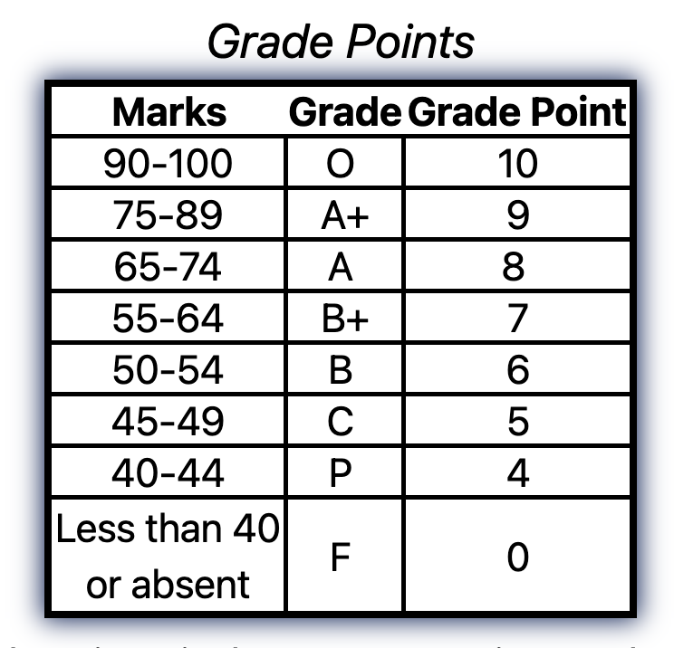

# CGPA Calculator in C

A simple terminal-based CGPA calculator written in C.

---

## This CGPA Calculator uses the following grade-to-grade-point conversion system:

---

## What You Need to Run This Project

Before you run the program, make sure you have the following:

- A **C compiler** like `gcc` (used to turn your code into a program).
- **Make** (helps to easily compile the code with one command).
- A terminal (like the one in macOS, Linux, or Windows with WSL).

> **macOS:** Install Xcode Command Line Tools:  
> `xcode-select --install`
>
> **Windows:** Install [MinGW](https://www.mingw-w64.org/) or use [WSL](https://learn.microsoft.com/en-us/windows/wsl/) (Windows Subsystem for Linux).

## How to Run This On Your Device

### First-Time Setup Instructions

> (Follow these steps when setting up the project for the first time.)

### ⒈ Navigate to Desktop (you can clone in any directory)

`cd Desktop`

### ⒉ Clone the Repository

`git clone https://github.com/manakcodes/cgpa-calc-using-c.git`

---

### How to Use the Calculator

> (Follow these steps to use the cgpa calculator every time.)

### ⒈Enter the project directory

`cd ~/Desktop/cgpa-calculator-in-c`

### ⒉ Compile the Source Code Using Makefile

`make`

### ⒊ Run the Program

`./Main`

### ⒋ Clean Build Artifacts (To remove compiled files and reset the project state)

`make clean`

---

## [license](https://github.com/manakcodes/cgpa-calc-using-c/blob/82ddf3f5669b9a5e2e3a5e4a131ae997368e6a7b/LICENSE)

## Project Tree

<pre>
<code>
.
├── grade_system.png
├── include
│   ├── cgpa_calculator.h
│   ├── get_result.h
│   ├── input_user.h
│   ├── print_resultset.h
│   └── utility_methods.h
├── LICENSE
├── Makefile
├── README.md
└── src
    └── Main.c

3 directories, 10 files
</code>
</pre>

---
